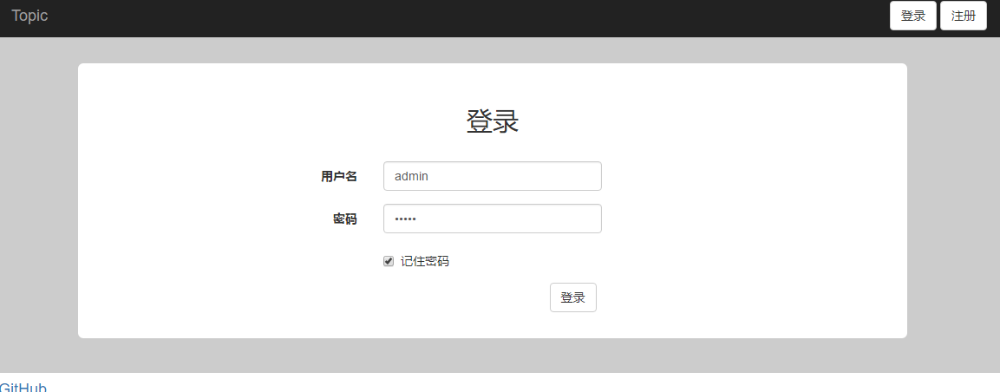
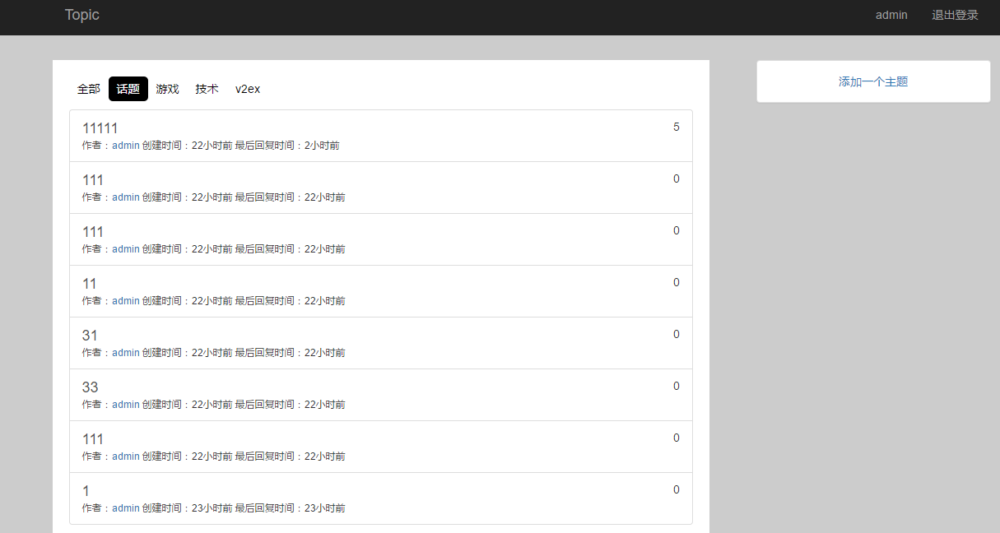
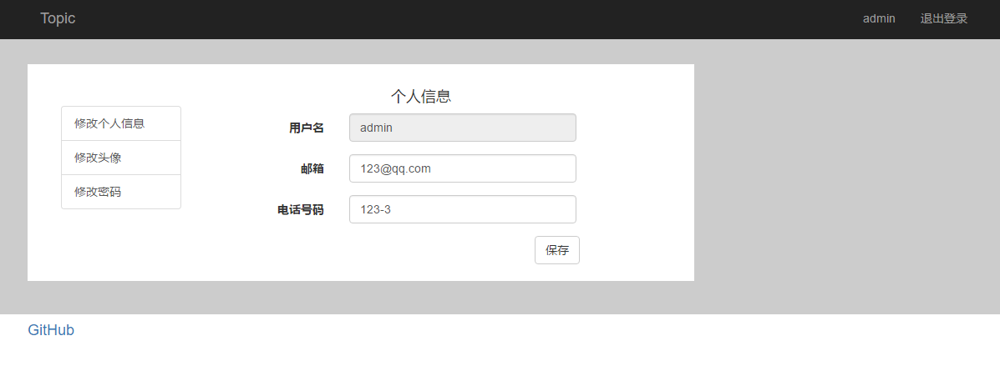
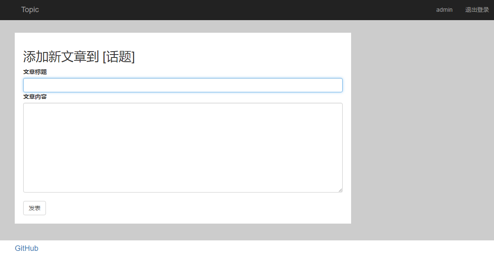

## Topic 在线论坛

### 平台介绍

Topic是一个简单的在线论坛，拥有发帖回帖等基本功能

### 截图

### 使用技术框架

后端

* Spring
* Spring MVC
* Mybatis
* JUnit
* Hibernate Validation

前端

* JQuery
* Bootstrap

### 运行要求

- JDK 1.8
- MySql 5.6
- Tomcat 6
- Maven
